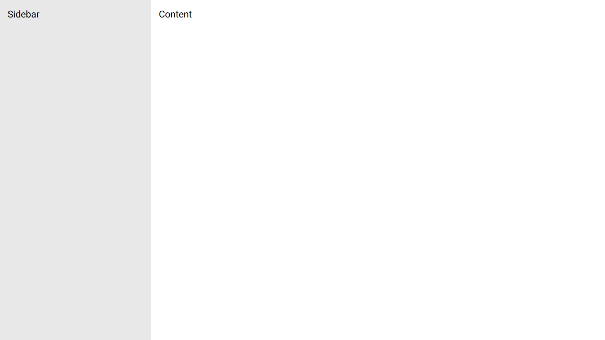
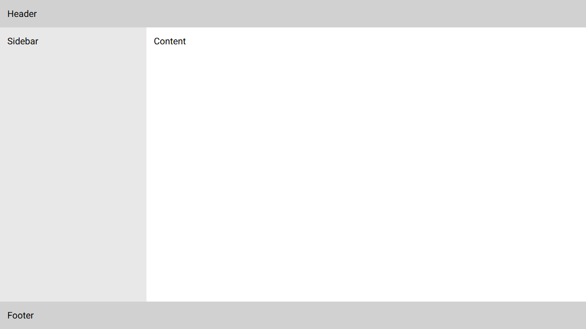
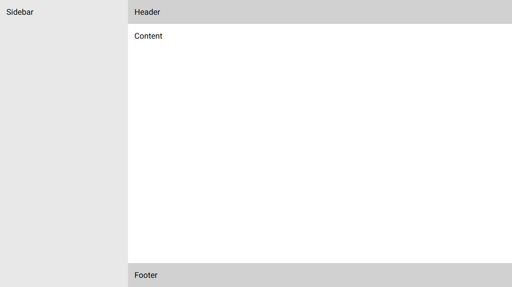
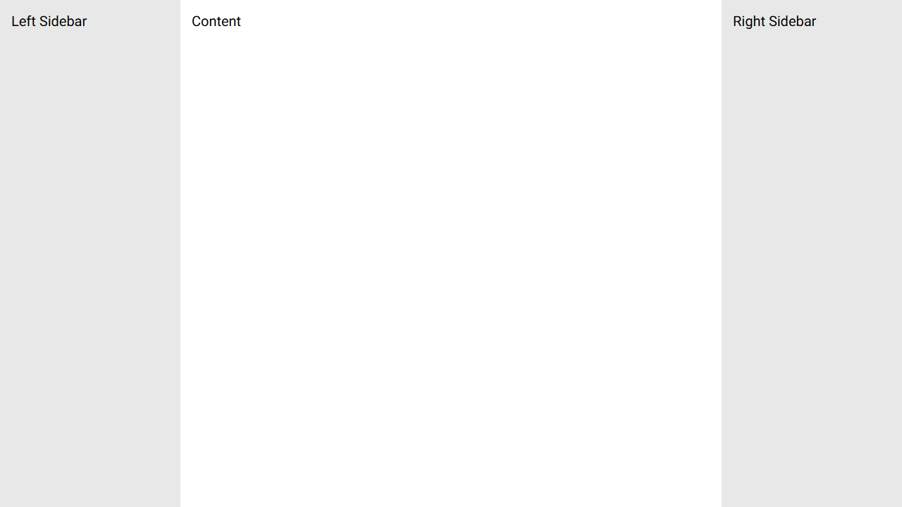
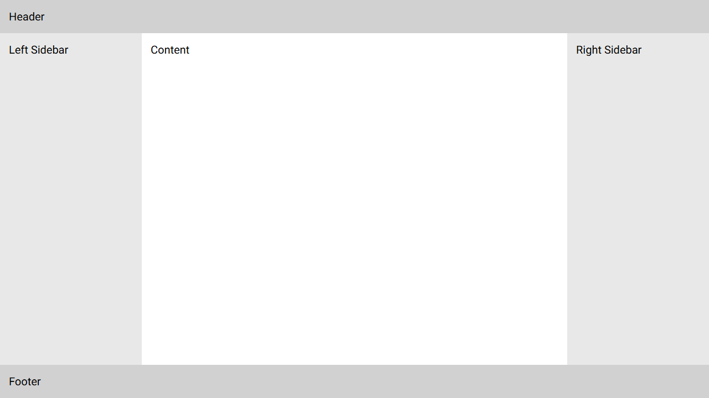
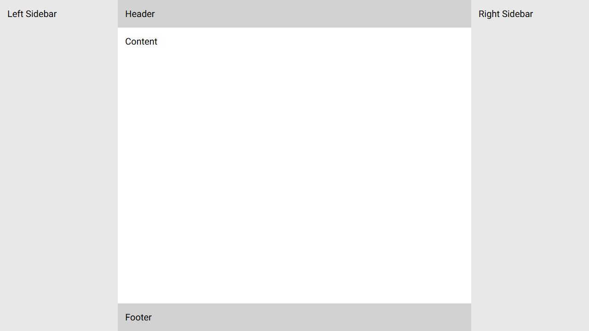
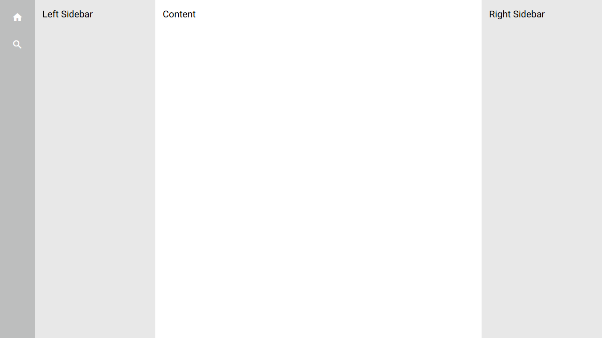
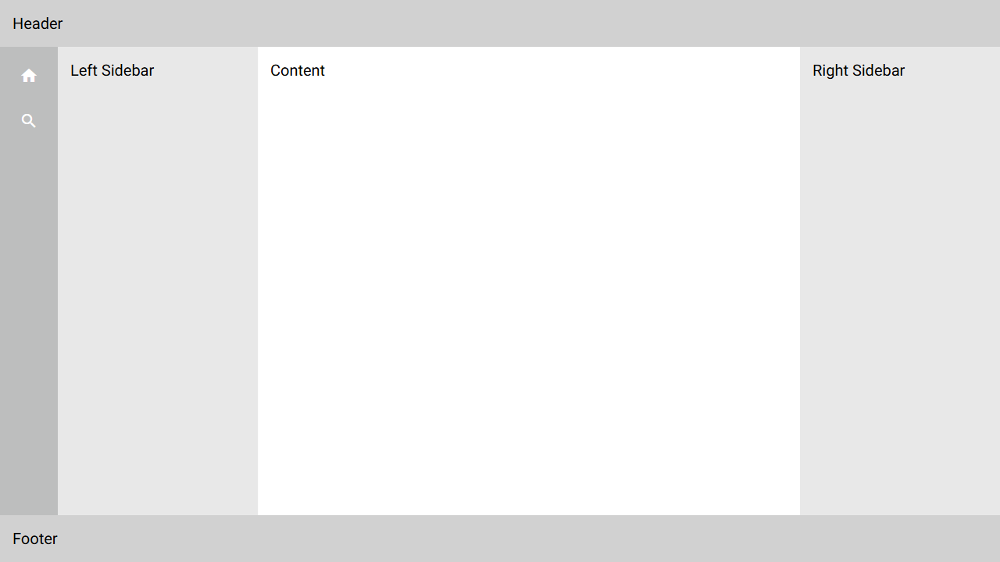
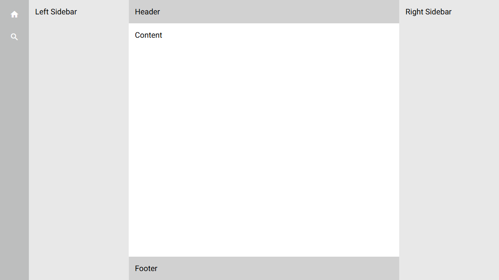
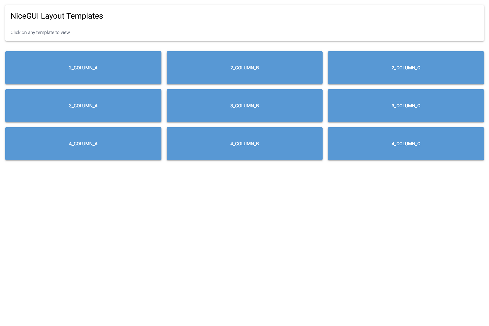

<div align="center">

# NiceGUI Tailwind Layout

NiceGUI에서 Tailwind만을 활용해 레이아웃을 구성하여 보다 자유롭게 커스터마이징할 수 있도록 만든 프로젝트입니다.

#### [English](README.md) | 한국어


</div>

## 공통 설정

모든 템플릿은 다음과 같은 기본 설정을 공유합니다:

### 색상 설정
```python
ui.colors(
    base_100="oklch(100% 0 0)",  # 가장 밝은 배경색
    base_200="oklch(93% 0 0)",   # 사이드바 배경색
    base_300="oklch(86% 0 0)",   # 헤더/푸터 배경색
    base_400="oklch(80% 0 0)",   # 메뉴바 배경색 (4단 레이아웃에서 사용)
)
```

### 레이아웃 스타일 설정
기본 패딩과 오버플로우 처리를 위한 설정:
```python
ui.query(".nicegui-content").style("padding: 0; overflow: hidden;")
```

## 레이아웃 템플릿

### 2 Column A ([source](templates/2_column_a.py))


```python
def app():
    with ui.element("div").classes("flex w-full h-screen"):
        # Sidebar
        with ui.element("div").classes("w-[30%] max-w-xs bg-base-200 p-4"):
            ui.label("Sidebar").classes("text-xl")
        # Main
        with ui.element("div").classes("grow bg-base-100 p-4"):
            ui.label("Content").classes("text-xl")
```

### 2 Column B ([source](templates/2_column_b.py))


```python
def app():
    with ui.element("div").classes("flex flex-col w-full h-screen"):
        # Header
        with ui.element("header").classes("min-h-[4%] bg-base-300 p-4"):
            ui.label("Header").classes("text-xl")
        # Main content with sidebar
        with ui.element("div").classes("flex grow"):
            with ui.element("div").classes("w-[30%] max-w-xs bg-base-200 p-4"):
                ui.label("Sidebar").classes("text-xl")
            with ui.element("div").classes("grow bg-base-100 p-4"):
                ui.label("Content").classes("text-xl")
        # Footer
        with ui.element("footer").classes("min-h-[4%] bg-base-300 p-4"):
            ui.label("Footer").classes("text-xl")
```

### 2 Column C ([source](templates/2_column_c.py))


```python
def app():
    with ui.element("div").classes("flex w-full h-screen"):
        # Sidebar
        with ui.element("div").classes("w-[30%] max-w-xs bg-base-200 p-4"):
            ui.label("Sidebar").classes("text-xl")

        # Main
        with ui.element("div").classes("flex flex-col grow h-full"):
            # Header
            with ui.element("header").classes("min-h-[4%] bg-base-300 p-4"):
                ui.label("Header").classes("text-xl")

            # Content
            with ui.element("div").classes("grow bg-base-100 p-4"):
                ui.label("Content").classes("text-xl")
            # Footer
            with ui.element("footer").classes("min-h-[4%] bg-base-300 p-4"):
                ui.label("Footer").classes("text-xl")
```

### 3 Column A ([source](templates/3_column_a.py))


```python
def app():
    with ui.element("div").classes("flex w-full h-screen"):
        # Left Sidebar
        with ui.element("div").classes("w-[20%] max-w-xs bg-base-200 p-4"):
            ui.label("Left Sidebar").classes("text-xl")
        # Content
        with ui.element("div").classes("grow bg-base-100 p-4"):
            ui.label("Content").classes("text-xl")
        # Right Sidebar
        with ui.element("div").classes("w-[20%] max-w-xs bg-base-200 p-4"):
            ui.label("Right Sidebar").classes("text-xl")
```

### 3 Column B ([source](templates/3_column_b.py))


```python
def app():
    with ui.element("div").classes("flex flex-col w-full h-screen"):
        # Header
        with ui.element("header").classes("bg-base-300 p-4"):
            ui.label("Header").classes("text-xl")

        # Main
        with ui.element("div").classes("flex flex-1"):
            # Left Sidebar
            with ui.element("div").classes("w-[20%] max-w-xs bg-base-200 p-4"):
                ui.label("Left Sidebar").classes("text-xl")

            # Content
            with ui.element("div").classes("grow bg-base-100 p-4"):
                ui.label("Content").classes("text-xl")

            # Right Sidebar
            with ui.element("div").classes("w-[20%] max-w-xs bg-base-200 p-4"):
                ui.label("Right Sidebar").classes("text-xl")

        # Footer
        with ui.element("footer").classes("bg-base-300 p-4"):
            ui.label("Footer").classes("text-xl")
```

### 3 Column C ([source](templates/3_column_c.py))


```python
def app():
    with ui.element("div").classes("flex w-full h-screen"):
        # Left Sidebar
        with ui.element("div").classes("w-[20%] max-w-xs bg-base-200 p-4"):
            ui.label("Left Sidebar").classes("text-xl")

        # Main
        with ui.element("div").classes("flex flex-col grow h-full"):
            # Header
            with ui.element("header").classes("min-h-[4%] bg-base-300 p-4"):
                ui.label("Header").classes("text-xl")

            # Content
            with ui.element("div").classes("grow bg-base-100 p-4"):
                ui.label("Content").classes("text-xl")

            # Footer
            with ui.element("footer").classes("min-h-[4%] bg-base-300 p-4"):
                ui.label("Footer").classes("text-xl")

        # Right Sidebar
        with ui.element("div").classes("w-[20%] max-w-xs bg-base-200 p-4"):
            ui.label("Right Sidebar").classes("text-xl")
```

### 4 Column A ([source](templates/4_column_a.py))


```python
def app():
    with ui.element("div").classes("flex w-full h-screen"):
        # MenuBar
        with ui.element("div").classes(
            "flex flex-col w-xs bg-base-400 p-4 items-center justify-start gap-4"
        ):
            ui.button(icon="home", color="base-100").props("flat round")
            ui.button(icon="search", color="base-100").props("flat round")
        # Left Sidebar
        with ui.element("div").classes("w-[20%] max-w-xs bg-base-200 p-4"):
            ui.label("Left Sidebar").classes("text-xl")
        # Content
        with ui.element("div").classes("grow bg-base-100 p-4"):
            ui.label("Content").classes("text-xl")
        # Right Sidebar
        with ui.element("div").classes("w-[20%] max-w-xs bg-base-200 p-4"):
            ui.label("Right Sidebar").classes("text-xl")
```

### 4 Column B ([source](templates/4_column_b.py))


```python
def app():
    with ui.element("div").classes("flex flex-col w-full h-screen"):
        # Header
        with ui.element("header").classes("bg-base-300 p-4"):
            ui.label("Header").classes("text-xl")

        # Main
        with ui.element("div").classes("flex flex-1"):
            # MenuBar
            with ui.element("div").classes(
                "flex flex-col w-xs bg-base-400 p-4 items-center justify-start gap-4"
            ):
                ui.button(icon="home", color="base-100").props("flat round")
                ui.button(icon="search", color="base-100").props("flat round")

            # Left Sidebar
            with ui.element("div").classes("w-[20%] max-w-xs bg-base-200 p-4"):
                ui.label("Left Sidebar").classes("text-xl")

            # Content
            with ui.element("div").classes("grow bg-base-100 p-4"):
                ui.label("Content").classes("text-xl")

            # Right Sidebar
            with ui.element("div").classes("w-[20%] max-w-xs bg-base-200 p-4"):
                ui.label("Right Sidebar").classes("text-xl")

        # Footer
        with ui.element("footer").classes("bg-base-300 p-4"):
            ui.label("Footer").classes("text-xl")
```

### 4 Column C ([source](templates/4_column_c.py))


```python
def app():
    with ui.element("div").classes("flex w-full h-screen"):
        # MenuBar
        with ui.element("div").classes(
            "flex flex-col w-xs bg-base-400 p-4 items-center justify-start gap-4"
        ):
            ui.button(icon="home", color="base-100").props("flat round")
            ui.button(icon="search", color="base-100").props("flat round")

        # Left Sidebar
        with ui.element("div").classes("w-[20%] max-w-xs bg-base-200 p-4"):
            ui.label("Left Sidebar").classes("text-xl")

        # Main
        with ui.element("div").classes("flex flex-col grow h-full"):
            # Header
            with ui.element("header").classes("min-h-[4%] bg-base-300 p-4"):
                ui.label("Header").classes("text-xl")

            # Content
            with ui.element("div").classes("grow bg-base-100 p-4"):
                ui.label("Content").classes("text-xl")

            # Footer
            with ui.element("footer").classes("min-h-[4%] bg-base-300 p-4"):
                ui.label("Footer").classes("text-xl")

        # Right Sidebar
        with ui.element("div").classes("w-[20%] max-w-xs bg-base-200 p-4"):
            ui.label("Right Sidebar").classes("text-xl")
```

## 기술 스택

- Python 3.12
- NiceGUI
- Tailwind CSS
- UV (패키지 매니저)

## 실행 방법

### 1. 의존성 설치:
```bash
git clone https://github.com/easydevv/nicegui-tailwind-layout.git
cd nicegui-tailwind-layout
```

```bash
uv venv
uv sync
```

### 2. 애플리케이션 실행:
```bash
python main.py
```

## 템플릿 목록

실행시 템플릿 목록을 보실 수 있습니다.

